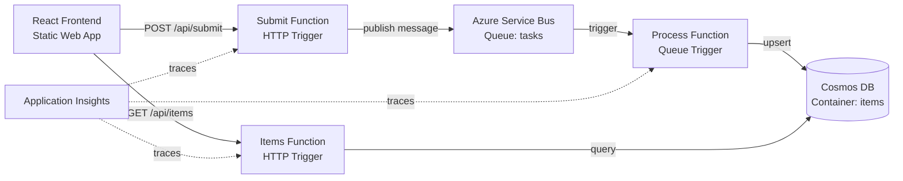

# azure-serverless-roundtrip

A complete, deployable reference architecture on Azure demonstrating an end-to-end serverless event-driven flow — the **serverless** counterpart to [`gcp-kubernetes-roundtrip`](https://github.com/gusrodriguez/gcp-kubernetes-roundtrip). Both repos implement the same architectural pattern (HTTP → message broker → async consumer → database, with correlation IDs, DLQ handling, and observability) but with opposite infrastructure philosophies. The goal is to showcase infrastructure-as-code, messaging, distributed tracing, and cost-conscious architecture choices — not application complexity.

### Serverless vs Serverfull at a Glance

|                        | azure-serverless-roundtrip (this repo) | [gcp-kubernetes-roundtrip](https://github.com/gusrodriguez/gcp-kubernetes-roundtrip) |
|------------------------|-------------------------------------|--------------------------------------|
| Compute                | Azure Functions (pay-per-invocation)| Kubernetes pods (long-running)       |
| Message broker         | Service Bus (managed)               | NATS JetStream (self-hosted)         |
| Database               | Cosmos DB (managed)                 | Postgres StatefulSet (self-hosted)   |
| Dead-letter queue      | Built-in (one config flag)          | Built from primitives (advisories)   |
| Observability          | Application Insights (automatic)    | Prometheus + Grafana (manual)        |
| Connection pooling     | N/A (cold starts per invocation)    | Long-lived pools (serverfull luxury) |
| CI end-to-end test     | Requires live Azure resources       | Fully local in kind (zero cost)      |
| Infrastructure-as-code | Pulumi → Azure                      | Pulumi → GCP                         |
| External API           | HTTP triggers (REST)                | GraphQL (graphql-yoga)               |
| Internal communication | Service Bus queue trigger           | gRPC + NATS pub/sub                  |



## The flow, step by step

1. User fills in a task (title + optional payload) in the React frontend and clicks Submit.
2. The **Submit function** validates the input (Zod), generates a `correlationId` (UUID v4) and timestamp, publishes an enriched message to the Service Bus queue, and returns `202 Accepted` with the correlation ID.
3. The **Process function** is triggered by the Service Bus message. It builds a `ProcessedItem`, upserts it into Cosmos DB (keyed by `correlationId` for idempotency), and emits telemetry events.
4. The frontend polls **GET /api/items** every 3 seconds. The **Items function** queries Cosmos DB for the most recent processed items and returns them.
5. The user sees their task appear in the "Processed Items" list — the full round trip is complete.

**What to look for in Application Insights:**

- Open the **Transaction search** or **End-to-end transaction details** view.
- Search by correlation ID. You should see a single operation spanning: HTTP request → Service Bus publish → queue trigger → Cosmos DB write.
- Custom events at each hop: `TaskSubmitted`, `TaskProcessing`, `TaskPersisted`.
- The `Diagnostic-Id` application property on the Service Bus message links the HTTP trace context to the consumer trace context.

## Design decisions

### Service Bus vs Storage Queues

Storage Queues are simpler and cheaper (included with every storage account), but Service Bus provides: dead-letter queues, `maxDeliveryCount`, message sessions, and richer metadata. For a reference architecture that demonstrates production messaging patterns, Service Bus is the right choice. We use the **Basic tier** ($0.05/13M operations) since we only need a single queue with one consumer.

If you needed multiple subscribers reacting to the same message — e.g. one function writes to Cosmos DB while another sends a notification email — you'd switch from a **queue** to a **topic with subscriptions**. Each subscription receives its own copy of the message, enabling fan-out. This requires upgrading to **Standard tier** ($10/month base).

### Consumption vs Premium plan

The Function App runs on the **Consumption (Y1)** plan: the first 1M executions and 400K GB-seconds per month are free. Cold starts are the trade-off — the first invocation after idle may take 1-2 seconds. For a reference project this is acceptable. You'd switch to **Premium (EP1)** if you need: always-warm instances, VNet integration, or predictable latency under load.

### Cosmos DB: provisioned free tier vs serverless

We use `enableFreeTier: true` with 400 RU/s provisioned throughput (out of the free tier's 1000 RU/s allowance). This makes the database effectively zero-cost forever. Serverless Cosmos charges per RU consumed with no monthly free grant — it can be cheaper for very sporadic traffic but doesn't benefit from the free tier discount. One free-tier account is allowed per Azure subscription.

### Partition key: `/id`

The document `id` is the `correlationId`. This gives us:
- Efficient point reads and upserts (every write is a single-partition operation).
- High cardinality for even data distribution.
- Cross-partition queries for listing items are fine at this scale (low volume, 400 RU/s is plenty).

At high scale, you'd add a time-based partition key (e.g., `/yearMonth`) to co-locate items for time-range queries.

### 202 Accepted + polling vs synchronous processing

Returning 202 decouples the HTTP response from the processing time. The client knows the request was accepted immediately. This pattern is standard for event-driven architectures: it prevents the HTTP call from timing out if processing is slow, enables retries via the queue, and lets you scale the consumer independently.

### DLQ strategy

Service Bus is configured with `maxDeliveryCount: 5` and `deadLetteringOnMessageExpiration: true`. If the Process function throws 5 times on the same message, it lands in the dead-letter sub-queue (`tasks/$deadletterqueue`). In production you would:
1. Build a small utility function or script to inspect/resubmit dead-letter messages.
2. Log the full exception + message body on the final failure so you can diagnose without re-processing.

### DLQ alerting

A growing dead-letter queue is a strong signal that the consumer function is failing or down. The recommended alerting approach:

1. **Grafana** with the Azure Monitor data source — create a dashboard panel that queries the DLQ message count (`ActiveMessageCount` on the `tasks/$deadletterqueue` sub-queue). Set an alert rule that fires when the count exceeds a threshold (e.g., > 0 for immediate awareness, or > 10 for noisy environments).
2. **Azure Monitor** as a simpler alternative — create a metric alert on the Service Bus namespace, filtering on `DeadLetteredMessages` for the `tasks` queue. This doesn't require Grafana but has less flexible dashboarding.

Either way, a non-zero DLQ depth should trigger an investigation: check the Process function's Application Insights logs for exceptions, verify the function is running (check the Consumption plan for cold-start issues or deployment failures), and inspect the dead-letter messages themselves for malformed payloads.

### OIDC federation over publish profiles

The GitHub Actions workflow uses `azure/login` with OIDC federation (federated credentials on an Azure AD app registration). This avoids storing long-lived secrets in GitHub: the token is issued per-workflow-run and scoped to the specific repo + branch. Publish profiles are simpler to set up but are static secrets that can leak and are harder to rotate.

### Correlation propagation

The Submit function captures `context.traceContext.traceParent` and sets it as the `Diagnostic-Id` application property on the Service Bus message. The Azure Functions runtime and Application Insights SDK use this to link the producer and consumer traces into a single distributed operation.

## Deploy your own

### Prerequisites

- An Azure account (free tier is sufficient).
- [Azure CLI](https://learn.microsoft.com/en-us/cli/azure/install-azure-cli) installed.
- [Pulumi CLI](https://www.pulumi.com/docs/install/) installed, with an account (free for individual use).
- [Node.js 20+](https://nodejs.org/) installed.

### One-time Azure & GitHub setup

1. **Create an Azure AD app registration** for OIDC:

   ```bash
   az ad app create --display-name "azure-serverless-roundtrip-github"
   ```

   Note the `appId` from the output.

2. **Create a service principal** and assign Contributor on your subscription:

   ```bash
   az ad sp create --id <appId>
   az role assignment create \
     --assignee <appId> \
     --role Contributor \
     --scope /subscriptions/<subscription-id>
   ```

3. **Add a federated credential** for your GitHub repo:

   ```bash
   az ad app federated-credential create --id <appId> --parameters '{
     "name": "github-main",
     "issuer": "https://token.actions.githubusercontent.com",
     "subject": "repo:<owner>/azure-serverless-roundtrip:ref:refs/heads/main",
     "audiences": ["api://AzureADTokenExchange"]
   }'
   ```

4. **Set GitHub repository variables** (Settings → Secrets and variables → Actions → Variables):

   | Variable | Value |
   |---|---|
   | `AZURE_CLIENT_ID` | The app registration `appId` |
   | `AZURE_TENANT_ID` | Your Azure AD tenant ID |
   | `AZURE_SUBSCRIPTION_ID` | Your Azure subscription ID |

5. **Set GitHub repository secrets**:

   | Secret | Value |
   |---|---|
   | `PULUMI_ACCESS_TOKEN` | Your Pulumi access token |
   | `AZURE_STATIC_WEB_APPS_API_TOKEN` | From the Static Web App resource after first deploy |

6. **Initialize the Pulumi stack**:

   ```bash
   cd infra
   pulumi stack init dev
   pulumi config set azure-native:location westeurope  # or your preferred region
   ```

### Deploy

Push to `main`. The GitHub Actions workflow will: build & test → deploy infrastructure with Pulumi → deploy the Function App → deploy the frontend.

### Cost

| Resource | Cost |
|---|---|
| Azure Functions (Consumption) | Free (1M executions/month) |
| Cosmos DB (Free tier, 400 RU/s) | Free (1000 RU/s + 25 GB included) |
| Static Web App (Free tier) | Free |
| Application Insights | Free (up to 5 GB/month ingestion) |
| Log Analytics | Free (up to 5 GB/month) |
| Storage Account | ~$0.01/month |
| **Service Bus (Basic)** | **~$0.05/month** (the only non-free component) |

Set a budget alert at $1/month in the Azure portal (Cost Management → Budgets) so there are no surprises.

## Teardown

```bash
cd infra
pulumi destroy
```

This removes the resource group and all resources inside it. Verify in the Azure portal that nothing is left behind (especially the Cosmos free-tier account, which is limited to one per subscription).

## Local development

### Prerequisites

- [Azure Functions Core Tools v4](https://learn.microsoft.com/en-us/azure/azure-functions/functions-run-local)
- [Azurite](https://learn.microsoft.com/en-us/azure/storage/common/storage-use-azurite) (for local storage emulation)
- A deployed Service Bus namespace (no local emulator exists — the Basic tier costs cents)
- Cosmos DB: either the [emulator](https://learn.microsoft.com/en-us/azure/cosmos-db/emulator) or connect to your deployed free-tier instance

### Setup

1. Install dependencies:

   ```bash
   npm install
   ```

2. Copy the example settings:

   ```bash
   cp api/local.settings.example.json api/local.settings.json
   ```

3. Fill in `api/local.settings.json` with your Service Bus connection string and Cosmos DB credentials. If using the Cosmos emulator, the endpoint is `https://localhost:8081` and the key is the well-known emulator key.

4. Start Azurite (in a separate terminal):

   ```bash
   azurite --silent
   ```

5. Start the Functions runtime:

   ```bash
   cd api
   npm run build && npm start
   ```

6. Start the frontend (in a separate terminal):

   ```bash
   cd frontend
   npm run dev
   ```

   The Vite dev server proxies `/api` requests to `http://localhost:7071`.

7. Open `http://localhost:5173` in your browser.

### Running tests

```bash
npm test
```

This runs Vitest tests in the `api` workspace covering input validation, message shaping, and idempotent upsert logic.

## Repo structure

```
azure-serverless-roundtrip/
├── api/                        # Azure Functions (TypeScript, v4 model)
│   ├── src/
│   │   ├── functions/          # submit, items, process
│   │   ├── lib/                # validation, cosmos, service-bus, telemetry
│   │   └── __tests__/          # Vitest tests
│   ├── host.json
│   ├── local.settings.example.json
│   └── vitest.config.ts
├── frontend/                   # React + Vite (TypeScript)
│   ├── src/
│   │   ├── App.tsx             # Single-page component
│   │   └── main.tsx
│   └── vite.config.ts
├── infra/                      # Pulumi (TypeScript)
│   ├── config.ts               # Pulumi config reader
│   ├── resource-group.ts
│   ├── storage.ts
│   ├── monitoring.ts           # Log Analytics + App Insights
│   ├── service-bus.ts
│   ├── cosmos.ts
│   ├── functions.ts            # App Service Plan + Function App
│   ├── static-web-app.ts
│   └── index.ts                # Stack outputs
└── .github/workflows/
    └── deploy.yml              # CI/CD with OIDC auth
```
