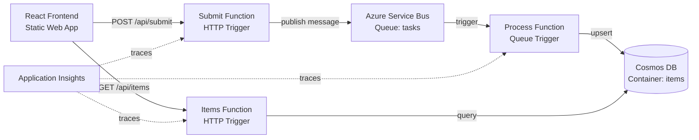

# azure-serverless-roundtrip

A complete, deployable reference architecture on Azure demonstrating an end-to-end serverless event-driven flow — the **serverless** counterpart to [`gcp-kubernetes-roundtrip`](https://github.com/gusrodriguez/gcp-kubernetes-roundtrip). Both repos implement the same architectural pattern (HTTP → message broker → async consumer → database, with correlation IDs, DLQ handling, and observability) but with opposite infrastructure philosophies. The goal is to showcase infrastructure-as-code, messaging, distributed tracing, and cost-conscious architecture choices — not application complexity.

### Serverless vs Containerized at a Glance

|                        | azure-serverless-roundtrip (this repo) | [gcp-kubernetes-roundtrip](https://github.com/gusrodriguez/gcp-kubernetes-roundtrip) |
| ---------------------- | -------------------------------------- | ------------------------------------------------------------------------------------ |
| Compute                | Azure Functions (pay-per-invocation)   | Kubernetes pods (long-running)                                                       |
| Message broker         | Service Bus (managed)                  | NATS JetStream (self-hosted)                                                         |
| Database               | Cosmos DB (managed)                    | Postgres StatefulSet (self-hosted)                                                   |
| Dead-letter queue      | Built-in (one config flag)             | Built from primitives (advisories)                                                   |
| Observability          | Application Insights (automatic)       | Prometheus + Grafana (manual)                                                        |
| Connection pooling     | N/A (cold starts per invocation)       | Long-lived pools (serverfull luxury)                                                 |
| CI end-to-end test     | Requires live Azure resources          | Fully local in kind (zero cost)                                                      |
| Infrastructure-as-code | Pulumi → Azure                         | Pulumi → GCP                                                                         |
| External API           | HTTP triggers (REST)                   | GraphQL (graphql-yoga)                                                               |
| Internal communication | Service Bus queue trigger              | gRPC + NATS pub/sub                                                                  |



## The round trip

Submit a task and the response is a `202 Accepted` with a correlation ID; the message travels HTTP → Service Bus → queue trigger → Cosmos DB, and the UI picks it up by polling `GET /api/items`:

```bash
curl -s -X POST https://<your-swa>.azurestaticapps.net/api/submit \
  -H 'Content-Type: application/json' \
  -d '{"title": "hello", "payload": {"n": 42}}'
# → 202 { "correlationId": "9f6c2e1a-...", "status": "accepted" }
```

### Tracing it in Application Insights

Once deployed, open **End-to-end transaction details** and search by the correlation ID. The whole round trip shows up as a **single distributed operation** — HTTP request → Service Bus publish → queue trigger → Cosmos DB write — stitched together via the `Diagnostic-Id` application property on the Service Bus message ([`api/src/lib/telemetry.ts`](api/src/lib/telemetry.ts)). Custom events mark each hop: `TaskSubmitted` → `TaskProcessing` → `TaskPersisted`.

## Design decisions

### Service Bus vs Storage Queues — [`infra/service-bus.ts`](infra/service-bus.ts)

Storage Queues are simpler and cheaper (included with every storage account), but Service Bus provides dead-letter queues, `maxDeliveryCount`, message sessions, and richer metadata.

### Consumption vs Premium plan — [`infra/functions.ts`](infra/functions.ts)

The Function App runs on the **Consumption (Y1)** plan: first 1M executions and 400K GB-seconds/month free. The trade-off is cold starts.

### Cosmos DB: provisioned free tier vs serverless — [`infra/cosmos.ts`](infra/cosmos.ts)

`enableFreeTier: true` with 400 RU/s provisioned (out of the free tier's 1000 RU/s allowance) makes the database effectively zero-cost forever. Serverless Cosmos charges per RU with no monthly free grant.

### Partition key: `/id`

The document `id` is the `correlationId`: single-partition point writes, high cardinality for even distribution, and cross-partition list queries that are fine at this scale.

### 202 Accepted + polling

Decouples the HTTP response from processing time — standard for event-driven flows. The queue absorbs retries; the consumer scales independently.

### DLQ handling — [`infra/service-bus.ts`](infra/service-bus.ts) + [`tools/dlq-inspect.ts`](tools/dlq-inspect.ts)

`maxDeliveryCount: 5` and `deadLetteringOnMessageExpiration: true`: if the Process function throws 5 times on the same message, it lands in `tasks/$deadletterqueue`. The repo includes a working CLI to inspect and resubmit dead-lettered messages:

```bash
npx tsx tools/dlq-inspect.ts list              # peek DLQ contents + failure reasons
npx tsx tools/dlq-inspect.ts resubmit          # move messages back to the main queue
npx tsx tools/dlq-inspect.ts resubmit --limit 5 --dry-run
```

For alerting, create an Azure Monitor metric alert on `DeadLetteredMessages`.

### OIDC federation over publish profiles — [`.github/workflows/deploy.yml`](.github/workflows/deploy.yml)

`azure/login` with OIDC federation (federated credentials on an Azure AD app registration): the token is issued per-workflow-run, scoped to repo + branch. No long-lived secrets in GitHub to leak or rotate.

### Correlation propagation — [`api/src/lib/telemetry.ts`](api/src/lib/telemetry.ts)

The Submit function captures `context.traceContext.traceParent` and sets it as the `Diagnostic-Id` application property on the Service Bus message. The Functions runtime and App Insights SDK use it to link producer and consumer traces into a single distributed operation.

## Deploy your own

### Prerequisites

- An Azure account (free tier is sufficient).
- [Azure CLI](https://learn.microsoft.com/en-us/cli/azure/install-azure-cli) installed.
- [Pulumi CLI](https://www.pulumi.com/docs/install/) installed, with an account (free for individual use).
- [Node.js 20+](https://nodejs.org/) installed.

### One-time Azure & GitHub setup

1. **Create an Azure AD app registration** for OIDC:

   ```bash
   az ad app create --display-name "azure-serverless-roundtrip-github"
   ```

   Note the `appId` from the output.

2. **Create a service principal** and assign Contributor on your subscription:

   ```bash
   az ad sp create --id <appId>
   az role assignment create \
     --assignee <appId> \
     --role Contributor \
     --scope /subscriptions/<subscription-id>
   ```

3. **Add a federated credential** for your GitHub repo:

   ```bash
   az ad app federated-credential create --id <appId> --parameters '{
     "name": "github-main",
     "issuer": "https://token.actions.githubusercontent.com",
     "subject": "repo:<owner>/azure-serverless-roundtrip:ref:refs/heads/main",
     "audiences": ["api://AzureADTokenExchange"]
   }'
   ```

4. **Set GitHub repository variables** (Settings → Secrets and variables → Actions → Variables):

   | Variable                | Value                        |
   | ----------------------- | ---------------------------- |
   | `AZURE_CLIENT_ID`       | The app registration `appId` |
   | `AZURE_TENANT_ID`       | Your Azure AD tenant ID      |
   | `AZURE_SUBSCRIPTION_ID` | Your Azure subscription ID   |

5. **Set GitHub repository secrets**:

   | Secret                            | Value                                               |
   | --------------------------------- | --------------------------------------------------- |
   | `PULUMI_ACCESS_TOKEN`             | Your Pulumi access token                            |
   | `AZURE_STATIC_WEB_APPS_API_TOKEN` | From the Static Web App resource after first deploy |

6. **Initialize the Pulumi stack**:

   ```bash
   cd infra
   pulumi stack init dev
   pulumi config set azure-native:location westeurope  # or your preferred region
   ```

### Deploy

Push to `main`. The GitHub Actions workflow will: build & test → deploy infrastructure with Pulumi → deploy the Function App → deploy the UI.

### Cost

| Resource                        | Cost                                           |
| ------------------------------- | ---------------------------------------------- |
| Azure Functions (Consumption)   | Free (1M executions/month)                     |
| Cosmos DB (Free tier, 400 RU/s) | Free (1000 RU/s + 25 GB included)              |
| Static Web App (Free tier)      | Free                                           |
| Application Insights            | Free (up to 5 GB/month ingestion)              |
| Log Analytics                   | Free (up to 5 GB/month)                        |
| Storage Account                 | ~$0.01/month                                   |
| **Service Bus (Basic)**         | **~$0.05/month** (the only non-free component) |

Set a budget alert at $1/month in the Azure portal (Cost Management → Budgets) so there are no surprises.

## Teardown

```bash
cd infra
pulumi destroy
```

This removes the resource group and all resources inside it. Verify in the Azure portal that nothing is left behind (especially the Cosmos free-tier account, which is limited to one per subscription).

## Local development

### Prerequisites

- [Azure Functions Core Tools v4](https://learn.microsoft.com/en-us/azure/azure-functions/functions-run-local)
- [Azurite](https://learn.microsoft.com/en-us/azure/storage/common/storage-use-azurite) (for local storage emulation)
- A Service Bus namespace. A [Docker-based emulator](https://learn.microsoft.com/en-us/azure/service-bus-messaging/test-locally-with-service-bus-emulator) exists if you want fully local dev; this repo assumes a deployed namespace, since the Basic tier costs cents and it's what CI targets anyway.
- Cosmos DB: either the [emulator](https://learn.microsoft.com/en-us/azure/cosmos-db/emulator) or a deployed free-tier instance.

### Setup

1. Install dependencies:

   ```bash
   npm install
   ```

2. Copy the example settings:

   ```bash
   cp api/local.settings.example.json api/local.settings.json
   ```

3. Fill in `api/local.settings.json` with your Service Bus connection string and Cosmos DB credentials. If using the Cosmos emulator, the endpoint is `https://localhost:8081` and the key is the well-known emulator key.

4. Start Azurite (in a separate terminal):

   ```bash
   azurite --silent
   ```

5. Start the Functions runtime:

   ```bash
   cd api
   npm run build && npm start
   ```

6. Start the UI (in a separate terminal):

   ```bash
   cd ui
   npm run dev
   ```

   The Vite dev server proxies `/api` requests to `http://localhost:7071`.

7. Open `http://localhost:5173` in your browser.

### Running tests

```bash
npm test
```

This runs Vitest tests in the `api` workspace covering input validation, message shaping, and idempotent upsert logic.

## Repo structure

```
azure-serverless-roundtrip/
├── api/                        # Azure Functions (TypeScript, v4 model)
│   ├── src/
│   │   ├── functions/          # submit, items, process
│   │   ├── lib/                # validation, cosmos, service-bus, telemetry
│   │   └── __tests__/          # Vitest tests
│   ├── host.json
│   ├── local.settings.example.json
│   └── vitest.config.ts
├── ui/                         # React + Vite (TypeScript)
│   ├── src/
│   │   ├── App.tsx             # Single-page component
│   │   └── main.tsx
│   └── vite.config.ts
├── infra/                      # Pulumi (TypeScript)
│   ├── config.ts               # Pulumi config reader
│   ├── resource-group.ts
│   ├── storage.ts
│   ├── monitoring.ts           # Log Analytics + App Insights
│   ├── service-bus.ts
│   ├── cosmos.ts
│   ├── functions.ts            # App Service Plan + Function App
│   ├── static-web-app.ts
│   └── index.ts                # Stack outputs
├── tools/
│   └── dlq-inspect.ts          # Inspect & resubmit dead-lettered messages
└── .github/workflows/
    └── deploy.yml              # CI/CD with OIDC auth
```